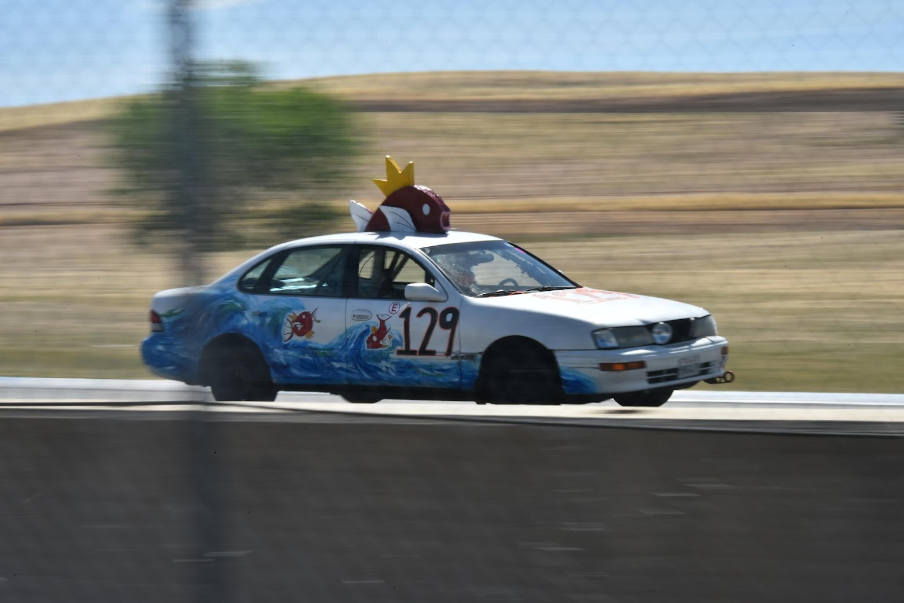
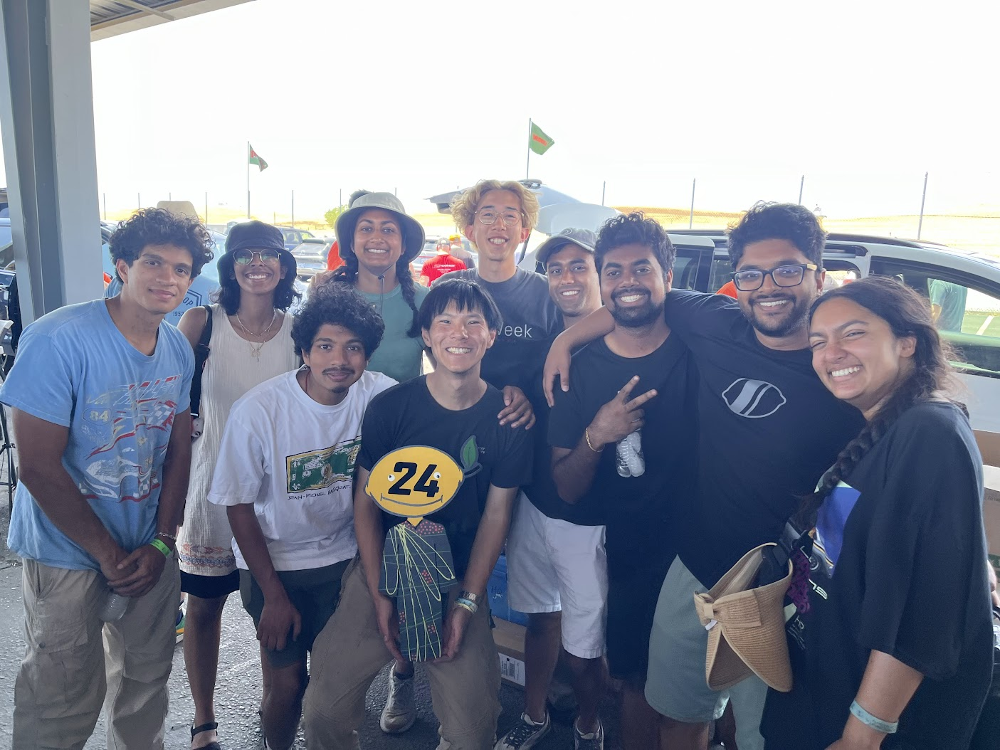
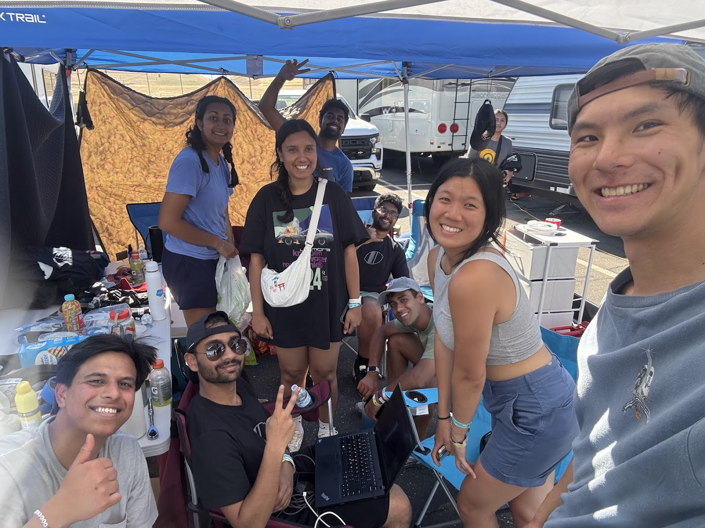

  

    
  

The car cookin it down the back straight

# Why
To have fun with the homies doing the absurd.

  

    
  

  

    
  

  
after we won judges choice

  
pit crew homies

# Build Reference
Here's a few handy pages that summarize the things we learned while building the car up to race spec.
- [Kill Switch](kill-switch)
- [Lights and Paint](lights-and-paint)
- [Brakes and Tires](tires-brakes)

# Logistics and Race Day
We learned a lot of things on test day and race day(s). Here's a dump. And additional thoughts since it was a 25-hour race.
- [Logistics and Operations](misc)
