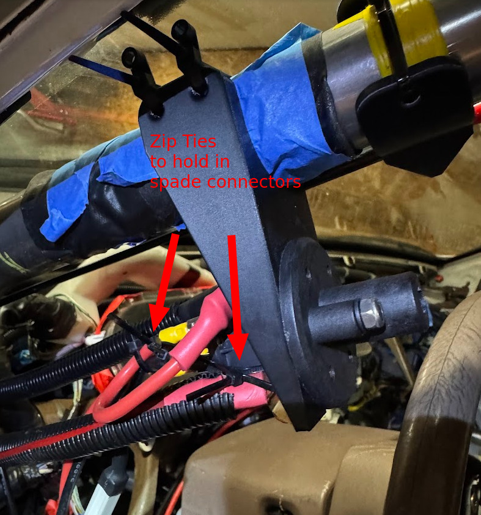
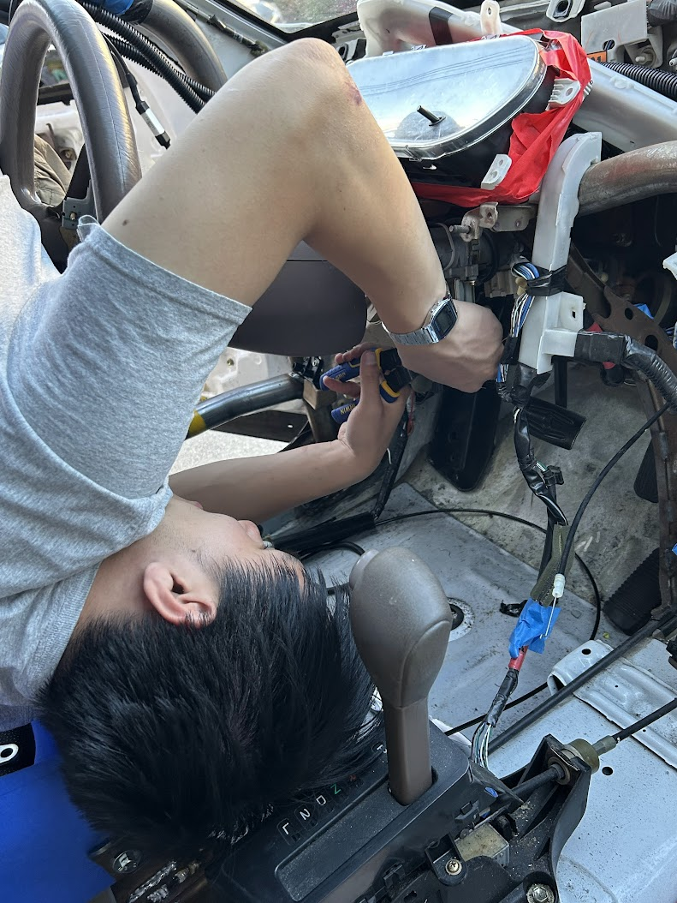
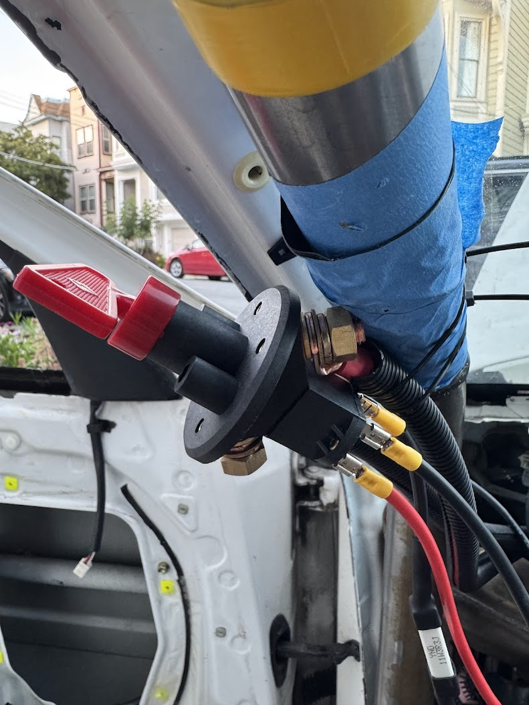

## BOM
- 2 gauge wire (10 ft)
- 10 gauge wire (10 ft)
- 6.3mm spade connectors
- FIA Kill Switch
- Butt Splice Connectors

## Tools
- Wire Crimpers
- 2 Gauge Large Wire Crimpers
- Electrical Tape

## Helpful Links
These two links helped me figure out how to wire things
- https://robrobinette.com/S2000CutoffSwitch.htm#:~:text=Pegasus%204%20Gauge%20Battery%20Cable&text=Use%203%2F8%22%20size%20holes%20for%20the%20cutoff%20switch%20terminals
- https://forums.24hoursoflemons.com/viewtopic.php?pid=337653#p337653
- https://www.youtube.com/watch?v=Q3Oshy9FOaA

  

    
  

## Good things we did
- We put our kill switch above and to the left of the steering wheel along the roll cage - we rotated the kill switch further out so that it wouldn't intefere with gloved hands moving along the steering wheel.

## Fumbles
- The FIA rated kill switch had a suprisingly long lead time - average lead time was 1 or 2 weeks. *do not wait to order this*.
- We wired it wrong the Z switch at first -- assumed the red wire going into the ignition was +12V, but in reality the white wire was +12V. Before performing a kill switch test we sanity checked all the voltages we was expecting to see, and we got 0V on a line that was supposed to be hot. So we knew something was wired wrong

## More Photos

  

    
  

  

    
  

  
stripping wires to prepare for soldering

  
testing things electrically before tieing down

