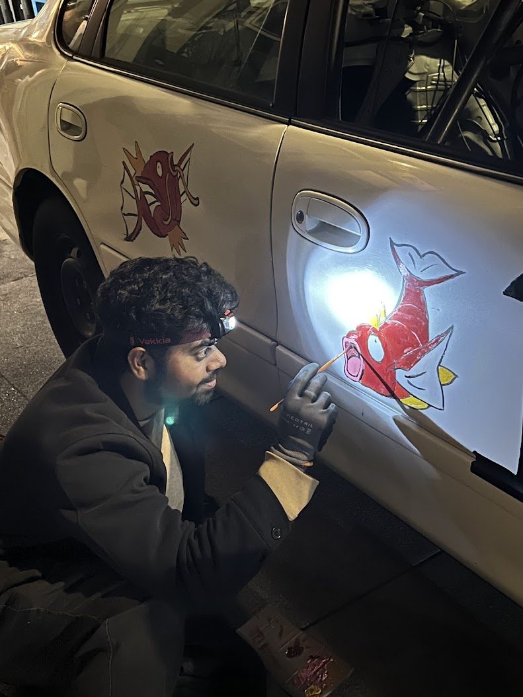

## Paint
Direct acrylic actually works way better than you might expect, especially if you go for the blended vibe that we have.

  

    
  

  

    
  

  
painting a fish

  
after busting out the blended blue

## Lighting

  

    
  

putting up the lights as a proof of concept

Figuring out how to hold on the EL wire was super hard. We eventually settled on using E6000, and it did hold during the race.

## Fish Construction

  

    
  

the insulation foam fish core

## Lessons
- Don't place numbers directly on hinges/door edges. This will make tracing it with lights very hard / not work at all lol.